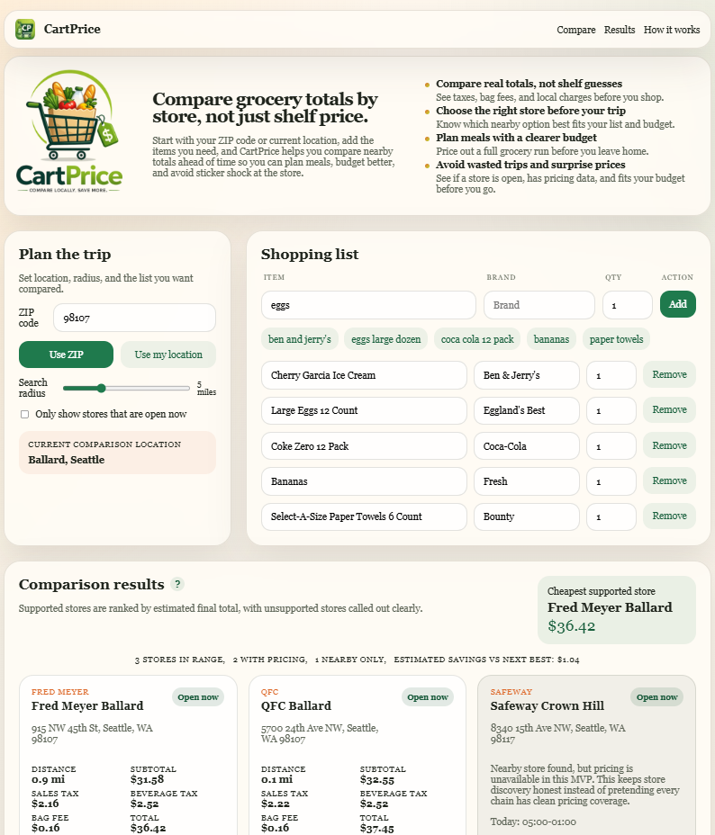

# CartPrice

CartPrice is a grocery cart comparison project with two tracks:

- a lightweight comparison UI for product and pricing experiments
- a compliant Node.js ingestion system for store-level grocery catalog, pricing, and availability data



This repo now includes an adapter-based ingestion MVP that prefers official APIs first and uses scraping only for public pages that are allowed to be crawled.

## Comparison architecture

CartPrice now uses one shared comparison domain with three provider modes:

- `demo`: uses the seeded catalog in [lib/data.ts](C:\Users\grace\OneDrive\Documents\Codex Projects\CartPrice\lib\data.ts) for UI development and product-flow testing
- `live`: uses ingestion artifacts only
- `auto`: uses live artifacts when they are usable, otherwise falls back to demo data with a clear warning

The shared comparison logic lives in [lib/comparison-domain.ts](C:\Users\grace\OneDrive\Documents\Codex Projects\CartPrice\lib\comparison-domain.ts).

- The seeded app flow uses [lib/compare.ts](C:\Users\grace\OneDrive\Documents\Codex Projects\CartPrice\lib\compare.ts) as a thin demo-data adapter over that shared domain.
- The backend and CLI use [lib/services/comparison-service.ts](C:\Users\grace\OneDrive\Documents\Codex Projects\CartPrice\lib\services\comparison-service.ts) to select `demo`, `live`, or `auto`.
- The ingestion comparison wrapper in [lib/ingestion/basket-compare.mjs](C:\Users\grace\OneDrive\Documents\Codex Projects\CartPrice\lib\ingestion\basket-compare.mjs) now delegates to the same consolidated service instead of maintaining a second ranking engine.

## Pricing model

CartPrice now distinguishes live prices by `pricingScope`:

- `store_level`: can drive cheapest-store ranking and store-to-store comparison
- `online_generic`: reference-only pricing that should not drive local store ranking
- `unknown`: excluded from cheapest-store ranking until the source is better understood

Current provider reality:

- `target-public` currently provides `online_generic` reference pricing only
- no provider currently has proven `store_level` pricing in this repo
- CartPrice is not ready for real local store comparison until a `store_level` source is validated

## Compliance principles

- Do not bypass logins, paywalls, CAPTCHAs, anti-bot systems, or blocked endpoints.
- Respect `robots.txt` and site terms before scraping public pages.
- Prefer official APIs over scraping when available.
- Use descriptive user agents, rate limiting, retries, caching, and audit logs.
- Do not collect personal data.
- Store source URLs and timestamps for every price record.
- Treat prices as estimates, not guaranteed checkout totals.

## What is implemented

### Source registry

- [config/grocery-sources.json](C:\Users\grace\OneDrive\Documents\Codex Projects\CartPrice\config\grocery-sources.json)
- Starts with:
  - Kroger API
  - Walmart public shopping pages
  - Target public shopping pages
  - Safeway / Albertsons public shopping pages
  - QFC / Fred Meyer via Kroger
  - Costco public shopping pages
  - Whole Foods / Amazon as manual-only unless official access exists
  - OpenStreetMap and Google Places for store discovery only

### Core basket

- [config/core-basket.json](C:\Users\grace\OneDrive\Documents\Codex Projects\CartPrice\config\core-basket.json)
- Includes 100+ common basket items with freshness priority labels

### Adapter system

- [lib/ingestion/adapter-contract.mjs](C:\Users\grace\OneDrive\Documents\Codex Projects\CartPrice\lib\ingestion\adapter-contract.mjs)
- [lib/ingestion/kroger-adapter.mjs](C:\Users\grace\OneDrive\Documents\Codex Projects\CartPrice\lib\ingestion\kroger-adapter.mjs)
- [lib/ingestion/store-discovery.mjs](C:\Users\grace\OneDrive\Documents\Codex Projects\CartPrice\lib\ingestion\store-discovery.mjs)

Each adapter follows the standard contract:

- `searchProducts({ query, storeId, zipCode })`
- `getProductDetails({ productId, storeId })`
- `normalizeProduct(rawProduct, context)`
- `validateSourceAccess()`
- `getRateLimitPolicy()`

### Historical storage

- SQL schema: [db/catalog-schema.sql](C:\Users\grace\OneDrive\Documents\Codex Projects\CartPrice\db\catalog-schema.sql)
- JSON persistence layer: [lib/ingestion/json-store.mjs](C:\Users\grace\OneDrive\Documents\Codex Projects\CartPrice\lib\ingestion\json-store.mjs)
- Output artifacts:
  - [data/ingestion-runs/latest.json](C:\Users\grace\OneDrive\Documents\Codex Projects\CartPrice\data\ingestion-runs\latest.json)
  - [data/products/normalized-products.json](C:\Users\grace\OneDrive\Documents\Codex Projects\CartPrice\data\products\normalized-products.json)
  - [data/prices/latest-prices.json](C:\Users\grace\OneDrive\Documents\Codex Projects\CartPrice\data\prices\latest-prices.json)
  - [data/errors/source-errors.json](C:\Users\grace\OneDrive\Documents\Codex Projects\CartPrice\data\errors\source-errors.json)
  - [data/matches/product-matches.json](C:\Users\grace\OneDrive\Documents\Codex Projects\CartPrice\data\matches\product-matches.json)

### Freshness rules

- [lib/ingestion/freshness-policy.mjs](C:\Users\grace\OneDrive\Documents\Codex Projects\CartPrice\lib\ingestion\freshness-policy.mjs)
- Current TTLs:
  - popular basket items: 6 hours
  - normal grocery items: 24 hours
  - long-tail items: 72 hours
  - promotion-sensitive items: 24 hours
  - store metadata: 30 days

### Product matching

- [lib/ingestion/matching.mjs](C:\Users\grace\OneDrive\Documents\Codex Projects\CartPrice\lib\ingestion\matching.mjs)
- Matching order:
  - UPC
  - exact brand + normalized name + size
  - fuzzy fallback with confidence and review flag

### CLI commands

`package.json` includes:

- `npm run ingest:stores`
- `npm run ingest:products -- --source=kroger --zip=98101 --query=milk`
- `npm run ingest:basket -- --zip=98101`
- `npm run refresh:prices`
- `npm run match:products`
- `npm run validate:sources`
- `npm run compare:basket -- --zip=98101`
- `npm run data:health`

## File structure

```text
config/
  grocery-sources.json
  core-basket.json
db/
  catalog-schema.sql
data/
  db/
  errors/
  ingestion-runs/
  matches/
  prices/
  products/
lib/
  ingestion/
    adapter-contract.mjs
    adapters.mjs
    config.mjs
    errors.mjs
    freshness-policy.mjs
    http-client.mjs
    ingestion-service.mjs
    json-store.mjs
    kroger-adapter.mjs
    matching.mjs
    normalization.mjs
    robots.mjs
    source-registry.mjs
    store-discovery.mjs
    utils.mjs
scripts/
  compare-basket.mjs
  ingest-basket.mjs
  ingest-products.mjs
  ingest-stores.mjs
  match-products.mjs
  refresh-prices.mjs
  validate-sources.mjs
```

## Environment

Populate `.env.local` or your shell environment as needed:

```powershell
$env:CARTPRICE_USER_AGENT="CartPriceBot/0.1 (+https://example.com/cartprice)"
$env:KROGER_CLIENT_ID="your-client-id"
$env:KROGER_CLIENT_SECRET="your-client-secret"
$env:GOOGLE_MAPS_API_KEY="optional-google-places-key"
```

The first ingestion priority is Kroger-family data plus OpenStreetMap-based store discovery. Google Places remains optional because its data storage and caching terms are more restrictive.

## Running the ingestion CLI

Examples:

```powershell
cd "C:\Users\grace\OneDrive\Documents\Codex Projects\CartPrice"
npm run validate:sources
```

```powershell
cd "C:\Users\grace\OneDrive\Documents\Codex Projects\CartPrice"
npm run ingest:stores -- --zip=98101
```

```powershell
cd "C:\Users\grace\OneDrive\Documents\Codex Projects\CartPrice"
npm run ingest:products -- --source=qfc --zip=98101 --query=milk
```

```powershell
cd "C:\Users\grace\OneDrive\Documents\Codex Projects\CartPrice"
npm run ingest:basket -- --zip=98101
```

```powershell
cd "C:\Users\grace\OneDrive\Documents\Codex Projects\CartPrice"
npm run compare:basket -- --zip=98101
```

## Demo data vs live data

Demo data exists to keep the UI and product flow usable even before live ingestion is available.

- Demo pricing is seeded and intended for development only.
- Live pricing comes from ingestion artifacts and should be treated as estimated until refreshed.
- Only `store_level` live pricing can drive cheapest-store ranking.
- `online_generic` live pricing is kept separately as `referencePricing`.
- `unknown` live pricing is excluded from ranking.
- `auto` mode falls back to demo data when live artifacts are empty or incomplete.
- Live comparison depends on a validated `store_level` source populating product and price artifacts.

## Basket comparison from ingested data

The backend basket comparison reads:

- [data/products/normalized-products.json](C:\Users\grace\OneDrive\Documents\Codex Projects\CartPrice\data\products\normalized-products.json)
- [data/prices/latest-prices.json](C:\Users\grace\OneDrive\Documents\Codex Projects\CartPrice\data\prices\latest-prices.json)
- [data/db/stores.json](C:\Users\grace\OneDrive\Documents\Codex Projects\CartPrice\data\db\stores.json)
- [data/matches/product-matches.json](C:\Users\grace\OneDrive\Documents\Codex Projects\CartPrice\data\matches\product-matches.json)

It outputs:

- per-store estimated subtotal
- item-level match details
- missing items
- stale price warnings
- cheapest available store by matched items
- reference-only online prices when store-level ranking data is not available

Latest comparison artifact:

- [data/compare/latest-basket-comparison.json](C:\Users\grace\OneDrive\Documents\Codex Projects\CartPrice\data\compare\latest-basket-comparison.json)

Health check:

- `npm run data:health`
- Reports product count, price count, store count, latest `observedAt`, latest `priceUpdatedAt`, and whether live comparison is currently usable

## Output data model

The normalized product shape is:

```json
{
  "source": "kroger",
  "retailer": "QFC",
  "pricingScope": "store_level",
  "storeId": "123",
  "storeName": "QFC Downtown",
  "productId": "0001111041700",
  "sku": "0001111041700",
  "upc": "0001111041700",
  "name": "2% Milk",
  "brand": "Kroger",
  "size": "1 gal",
  "unit": "gal",
  "category": "Dairy",
  "imageUrl": "https://...",
  "productUrl": "https://...",
  "price": 4.99,
  "regularPrice": 5.49,
  "salePrice": 4.99,
  "unitPrice": 4.99,
  "currency": "USD",
  "availability": "in_stock",
  "fulfillmentModes": ["PICKUP", "DELIVERY"],
  "lastSeenAt": "2026-05-05T00:00:00.000Z",
  "priceUpdatedAt": "2026-05-05T00:00:00.000Z",
  "sourceUrl": "https://api.kroger.com/v1/products?...",
  "raw": {}
}
```

## How to add a new retailer adapter

1. Add the retailer to [config/grocery-sources.json](C:\Users\grace\OneDrive\Documents\Codex Projects\CartPrice\config\grocery-sources.json).
2. Decide the access type:
   - `api`
   - `scrape`
   - `manual`
3. If the source is scrape-based:
   - validate `robots.txt`
   - confirm the path is allowed
   - add low request rates, retries, caching, and backoff
4. Create a new adapter in `lib/ingestion/`.
5. Implement:
   - `searchProducts`
   - `getProductDetails`
   - `normalizeProduct`
   - `validateSourceAccess`
   - `getRateLimitPolicy`
6. Register it in [lib/ingestion/adapters.mjs](C:\Users\grace\OneDrive\Documents\Codex Projects\CartPrice\lib\ingestion\adapters.mjs).
7. Make sure every price and stock record stores:
   - source URL
   - observed timestamp
   - store context
   - confidence score

## Known limitations

- Kroger credentials are required for live Kroger-family ingestion.
- Store discovery currently uses OpenStreetMap Nominatim for the generic discovery path.
- Non-Kroger retailers are registry-backed for validation and planning, but their adapters are not implemented yet.
- `kroger-public` is currently disabled as a scrape source because simple unauthenticated requests to Kroger public pages and `robots.txt` timed out during proof testing, so it is not a viable first public scrape target right now.
- `target-public` is useful for generic online PDP reference pricing, but it is not a proven store-level pricing source and cannot drive cheapest-store ranking.
- No provider in the repo currently has proven store-level pricing for real local grocery comparison.
- Public prices are still estimates and may differ from checkout totals due to taxes, fees, substitutions, and time-sensitive promotions.
- `compare:basket` can fall back to demo mode, but live price accuracy is blocked until normalized product and price artifacts have been populated by successful ingestion.
