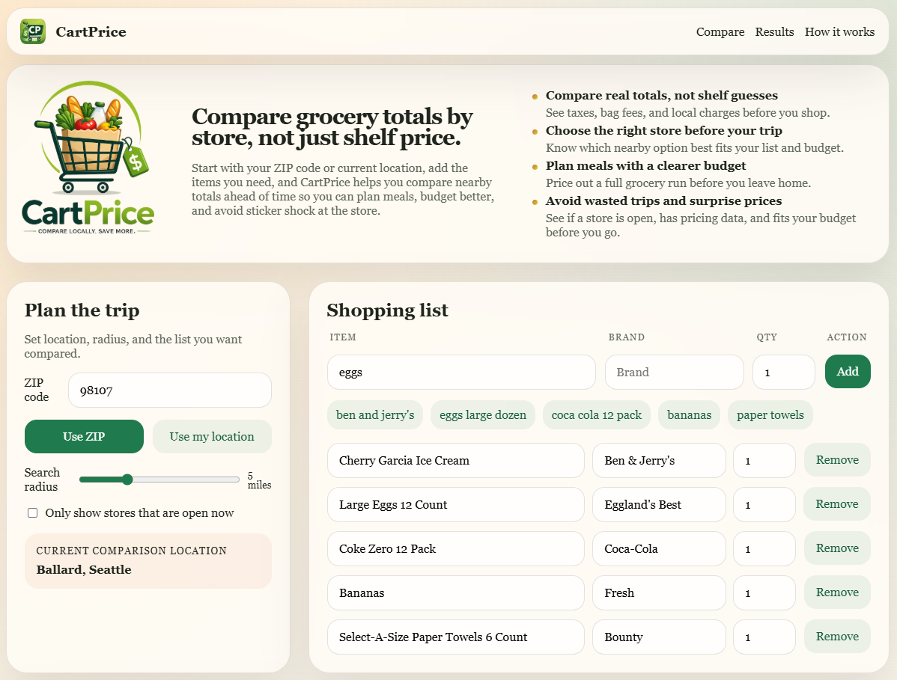

# CartPrice

CartPrice is a mobile-friendly grocery comparison MVP focused on the part that can be honest on day one:

- discover nearby grocery stores
- compare totals for supported pricing partners
- show unsupported stores as nearby but unavailable for pricing
- include store hours, open-now filtering, Washington sales tax, Seattle sweetened beverage tax, and Seattle 2026 bag fees

## Preview

  

## MVP scope in this repo

This first version is intentionally seeded with demo data instead of live APIs so we can validate product flow and pricing logic before integrating providers. The repo now also includes integration scaffolding for real provider wiring.

Current behavior:

- ZIP-based or browser-based location input
- radius filter
- editable shopping list
- fuzzy product matching against supported store catalogs
- store totals with subtotal, sales tax, beverage tax, bag fee, and final total
- open-now filter and display of today's store hours
- unsupported nearby stores displayed separately

## Recommended real integrations

The code structure is set up to evolve toward:

- `store-service`: Google Places for store discovery, hours, and open-now support
- `catalog-service`: Kroger Developers APIs for initial official pricing coverage
- `tax-service`: Washington DOR tax lookup
- `pricing-service`: tax, beverage tax, and bag fee calculations
- `comparison-service`: ranking and savings summaries

Recommended rollout order:

1. `Google Places API`
2. `Kroger Developers API`
3. `Washington DOR tax lookup`
4. `MealMe` for broader multi-store expansion
5. `Apify` / `FoodSpark` only as fallback scraping layers

## Project structure

- [app/page.tsx](C:/Users/grace/OneDrive/Documents/Codex%20Projects/CartPrice/app/page.tsx)
- [app/globals.css](C:/Users/grace/OneDrive/Documents/Codex%20Projects/CartPrice/app/globals.css)
- [lib/data.ts](C:/Users/grace/OneDrive/Documents/Codex%20Projects/CartPrice/lib/data.ts)
- [lib/compare.ts](C:/Users/grace/OneDrive/Documents/Codex%20Projects/CartPrice/lib/compare.ts)
- [lib/types.ts](C:/Users/grace/OneDrive/Documents/Codex%20Projects/CartPrice/lib/types.ts)
- [lib/integrations/config.ts](C:/Users/grace/OneDrive/Documents/Codex%20Projects/CartPrice/lib/integrations/config.ts)
- [lib/integrations/google-places.ts](C:/Users/grace/OneDrive/Documents/Codex%20Projects/CartPrice/lib/integrations/google-places.ts)
- [lib/integrations/kroger.ts](C:/Users/grace/OneDrive/Documents/Codex%20Projects/CartPrice/lib/integrations/kroger.ts)
- [lib/integrations/tax.ts](C:/Users/grace/OneDrive/Documents/Codex%20Projects/CartPrice/lib/integrations/tax.ts)
- [lib/services/comparison-service.ts](C:/Users/grace/OneDrive/Documents/Codex%20Projects/CartPrice/lib/services/comparison-service.ts)
- [docs/integrations.md](C:/Users/grace/OneDrive/Documents/Codex%20Projects/CartPrice/docs/integrations.md)

## Next steps

1. Replace seeded ZIP and store data with a real places provider.
2. Move comparison logic into server-side services and API routes.
3. Cache product catalogs and tax lookups.
4. Add user confirmation for low-confidence matches.
5. Persist shopping lists and comparison runs in PostgreSQL.
